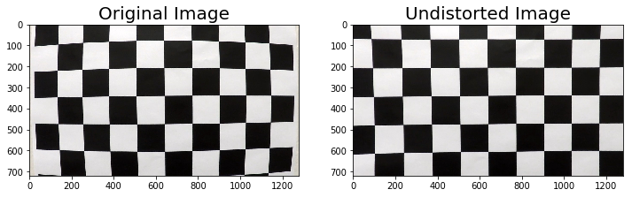
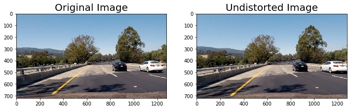
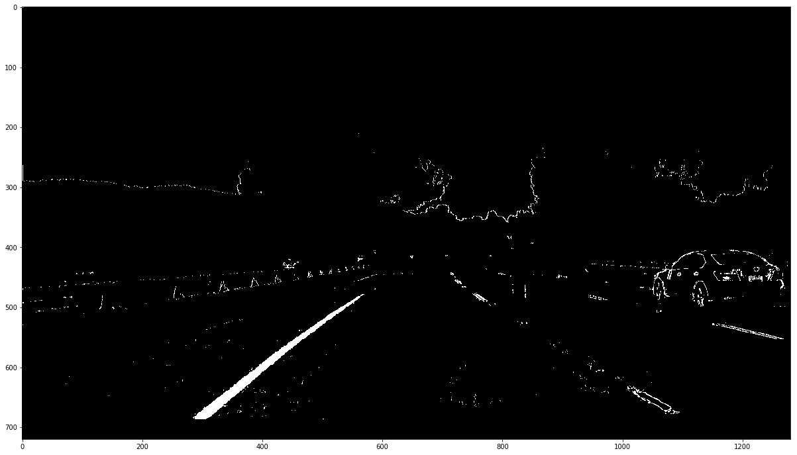
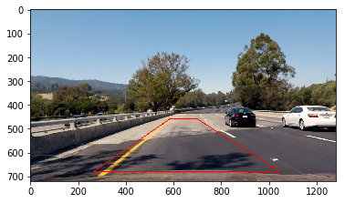
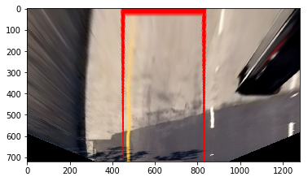
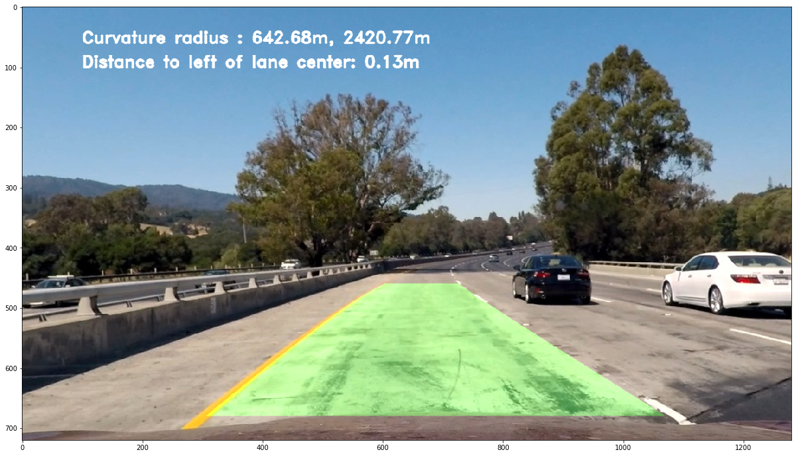

# Advanced Lane Finding Project

The goals / steps of this project are the following:

* Compute the camera calibration matrix and distortion coefficients given a set of chessboard images.
* Apply a distortion correction to raw images.
* Use color transforms, gradients, etc., to create a thresholded binary image.
* Apply a perspective transform to rectify binary image ("birds-eye view").
* Detect lane pixels and fit to find the lane boundary.
* Determine the curvature of the lane and vehicle position with respect to center.
* Warp the detected lane boundaries back onto the original image.
* Output visual display of the lane boundaries and numerical estimation of lane curvature and vehicle position.

## Project Structure

* `notebooks`
  * `analyze.ipynb`: a Jupyter notebook  for prototyping the system
  * `lane_finding.ipynb`:  a Jupiter notebook containing code for video pipeline analysis
* `calibration.p`: camera calibration result
* `test_videos_result`
  * `project_video_result.mp4`
  * `project_video_result_diagnosis.mp4`
  * `challenge_video_result.mp4`
  * `challenge_video_result_diagnosis.mp4`
* `output_images`: sample output images

### Camera Calibration

#### 1. Briefly state how you computed the camera matrix and distortion coefficients. Provide an example of a distortion corrected calibration image.

The code for this step is contained in the “Camera Calibration and Distortion Correction” of the IPython notebook located in “./notebooks/analyze.ipynb“  

To calibrate the camera, I created two arrays:

1. `objpionts`: this array stores the coordinates of chessboard corners in real world space, This is replcated array of coordinates of the Chessboard corners in 3D. Because I assume the (x, y) plane is fixed at z=0, I just need to pass the X,Y values at each time.
2. `imgpoints`: this array stores the 2D points in the image plane.

I then use the `cv2.calibrateCamera()` to compute the camera calibration matrix and distortion coeffients. The calibration result is saved at `calibration.p` file. 

I uses the `cv2.undistort` function to undistort the image using the calibration. This is an example output by applying the undistortion:



### Pipeline (single images)

#### 1. Provide an example of a distortion-corrected image.

To demonstrate this step, I will describe how I apply the distortion correction to one of the test images like this one:



#### 2. Describe how (and identify where in your code) you used color transforms, gradients or other methods to create a thresholded binary image.  Provide an example of a binary image result.

I created two detectors: yellow line and white line detector.

For the yellow line detection, I use the B-channel from the LAB color space. The B-channel represents the color blue and yellow. It is robust for detecting yellow color as I tried so far.

For the white line detection, I use the L-channel plus the Sobel x gradients. I cannot find single color channel that provide robust enough result for white line detection. And the output by only applying The Sobel x gradients thresholds give too noisy results.
After combining the L-channel and x gradients thresholds I get much better result for white line detection.

I conduct normalization for both B and L channels. The thresholds are tuned by trial and error after applying to the test images and videos.

This is the binarization code from the "Binarization" part in `lane_finding.ipynb`:

```python
def select_gradient_color(img, sx_thresh=(30, 100), l_thresh=(170, 255), b_thresh = (185, 255)):
    # convert into LAB color space
    lab = cv2.cvtColor(img, cv2.COLOR_RGB2LAB)

    # l channel
    l = lab[:, :, 0]
    l = l*255./np.max(l)
  
    # b channel: normalize only yellow points
    b = lab[:, :, 2]
    if np.max(b) >= 175:
        b = b*255./np.max(b)
  
    # sobel x
    sobelx = cv2.Sobel(l, cv2.CV_64F, 1, 0) 
    abs_sobelx = np.absolute(sobelx)
    scaled_sobel = np.uint8(255*abs_sobelx/np.max(abs_sobelx)) 
  
    # select yellow line with thresholds on B channel
    yellow_bin = np.zeros_like(b)
    mask = ((b > b_thresh[0]) & (b <= b_thresh[1]))
    yellow_bin[mask] = 255
  
    # select white line with Sobel x and L channel
    white_bin = np.zeros_like(scaled_sobel) 
    mask = ((scaled_sobel >= sx_thresh[0]) &
            (scaled_sobel <= sx_thresh[1]) & 
            (l > l_thresh[0]) & 
            (l <= l_thresh[1]))
    white_bin[mask] = 255

    return white_bin, yellow_bin
```

This is an example output after applying the binarization:



#### 3. Describe how (and identify where in your code) you performed a perspective transform and provide an example of a transformed image

This is the code I used to transform the perpective after image undistortion. The code can also be found in the "Undistortion and Perspective Transform" part in the `lane_finding.ipynb`. I chose the hardcode the source and destination points.

The `ImageProcessor` class perform both undistortion and perpective transform. It stores the camera calibration data and the source points (`src`) and destination points (`dst`).

```python
class ImageProcessor:
    def __init__(self, calibration_file, img_shape=(720, 1280)):
        w = 350
        h = 0
        self.src = np.float32([[265, 680], [583, 460], [701, 460], [1044, 680]])
        self.dst = np.float32([[w, 720], [w, h], [img_shape[1]-w, h], [img_shape[1]-w, 720]])
        self.calibration_file = calibration_file
        # get calibration
        with open(self.calibration_file, 'rb') as f:
            self.calibration = pickle.load(f)

    @property
    def M(self):
        return cv2.getPerspectiveTransform(self.src, self.dst)
  
    @property
    def Minv(self):
        return cv2.getPerspectiveTransform(self.dst, self.src)
  
    def undist_img(self, img):
        mtx = self.calibration['mtx']
        dist = self.calibration['dist']
        undist = cv2.undistort(img, mtx, dist, None, mtx)
  
        return undist

    def transform_perspective(self, img, undist_flag=True):
        img_shape = img.shape[1], img.shape[0]
        if undist_flag:
            img = self.undist_img(img)
        warped = cv2.warpPerspective(img, self.M, img_shape)

        return warped
```

I verified that my perspective transform was working as expected by drawing the `src` and `dst` points onto a test image and its warped counterpart to verify that the lines appear parallel in the warped image.

<p float="left">
  
  
</p>

#### 4. Describe how (and identify where in your code) you identified lane-line pixels and fit their positions with a polynomial?

After binarizing the image, I locate the pixel by sliding window search:

1. Pick up the peaks at the left and right of the histogram (aggregate by height)
2. Start from the peaks, count the number of nonzero pixels in the window. If the number of pixels is larger than the minimum number (predefined), the x value of the center point of the nonzero points in that window will become the base value for the next window on x-axis.

Based on the detected non-zero points, I conducted polynomial fit the positions with this method:


For video pipeline, detector will search around the marings of the previous fitting. This will reduce the search time and add more robustness for pixel detection.

The code for lane-line pixels finding is in the "Lane detection" part (`find_lane_pixels` and `search_around_poly`).

#### 5. Describe how (and identify where in your code) you calculated the radius of curvature of the lane and the position of the vehicle with respect to center.

The calculation of radius of curvature and the position of the vehicle to the line is included in the `Line` class definition:

```python
class Line():
    # ...definitions before...
    @property
    def curvature(self):
        fit = self.avg_fit
        y_eval = np.max(self.ploty)
        curv = ((1+(2*fit[0]*y_eval+fit[1])**2)**1.5)/np.absolute(2*fit[0])
        return curv

    @property
    def curvature_m(self):
        fitx = self.recent_fitx[-1]
        fit_m = np.polyfit(self.ploty*self.ym_per_pix, fitx*self.xm_per_pix, 2)
        y_eval = np.max(self.ploty)
        curv_m = ((1+(2*fit_m[0]*y_eval*self.ym_per_pix+fit_m[1])**2)**1.5)/np.absolute(2*fit_m[0])
  
        return curv_m
  
    @property
    def dist_to_lane(self):
        h, _ = self.image_shape
        fit = self.avg_fit

        # calculate lane position at height h
        line_x = fit[0]*h**2+fit[1]*h+fit[2]
        return line_x
```

To calcuate the curvature in meters, I first fitted the polynomial line after converting all points into meters.

To calculate the position of vehicle to the center of the lane, I used this code (`dist_to_middle` function in the "Lane detection" part in `lane_finding.ipynb`:

```python
def dist_to_middle(l_line, r_line):
    car_pos = l_line.image_shape[1]/2
    line_middle_pos = (r_line.dist_to_lane + l_line.dist_to_lane) / 2
  
    return (car_pos - line_middle_pos)*l_line.xm_per_pix
```

#### 6. Provide an example image of your result plotted back down onto the road such that the lane area is identified clearly.

I implemented this step in the `draw_lane_line` function in the `lane_finding.ipynb`. Here is an example output after drawing the fitted lines with the `cv2.fillPoly` function:



---

### Pipeline (video)

#### 1. Provide a link to your final video output.  Your pipeline should perform reasonably well on the entire project video (wobbly lines are ok but no catastrophic failures that would cause the car to drive off the road!)

* [Link to `project_video_result.mp4`][1]
* [Link to `challenge_video_result.mp4`][2]

---

### Discussion

#### 1. Briefly discuss any problems / issues you faced in your implementation of this project.  Where will your pipeline likely fail?  What could you do to make it more robust?

I find the binarization is the most different part for this project.
I tried difficult combinations of color channels and gradient thresholds. My current method picks up the white line and yellow line separately. It works well in most scenarios in both "project_video.mp4" and "challenge_video.mp4". But it failed on some of the difficult frames in "challenge_video.mp4" because of the heavy shadows.

Currently the entire pipeline is manually setup and all the hyperparameters are also set manually after lots of trial-and-errors.
I would like to research on how to applying the deep learning methodology to make the lane detection task easier and more robust.

Lastly, my pipeline cannot work well on the "harder_challenge_video.mp4". I am thinking how to improve the result by build a better line detector to pass this one.

[1]:	./test_videos_result/project_video_result.mp4
[2]:	./test_videos_result/challenge_video_result.mp4